# Angular Blog App - Klassendiagramm

## Zielarchitektur mit State Management

Das folgende Klassendiagramm zeigt die vollständige Architektur der Angular Blog-Anwendung mit allen implementierten Features, Services und State Management Komponenten.

### Features:

- **BlogOverview**: Übersichtsseite mit Filterung und Like-Funktionalität
- **BlogDetail**: Detailansicht einzelner Blog-Posts
- **AddBlog**: Formular zum Erstellen neuer Blog-Posts

### Core Module:

- **Layout**: Header, Footer, Sidebar Komponenten
- **Static**: Error und NotFound Komponenten
- **Services**: BlogService und AuthService
- **State**: BlogStateStore und RouterStateStore für zentrales State Management

### Besonderheiten:

- Alle Komponenten verwenden Input/Output Signals statt Decorators
- OnPush Change Detection Strategy für optimale Performance
- Redux-ähnliches State Management mit Angular Signals
- Role-based Access Control über AuthService
- Loading States während Navigation und Datenladung

```mermaid
classDiagram
    %% Core Module Components
    class HeaderComponent {
        +output toggleSidebar
        +output toggleDarkMode
        +navigationItems Array
        +ChangeDetectionStrategy OnPush
    }

    class FooterComponent {
        +currentYear number
        +socialLinks Array
        +ChangeDetectionStrategy OnPush
    }

    class SidebarComponent {
        +input isOpen boolean
        +output closeSidebar
        +navigationItems Array
        +secondaryItems Array
        +onNavigate() void
        +ChangeDetectionStrategy OnPush
    }

    class NotFoundComponent {
        +ChangeDetectionStrategy OnPush
    }

    class ErrorComponent {
        +input errorCode number
        +input errorMessage string
        +input errorDetails string
        +reloadPage() void
        +ChangeDetectionStrategy OnPush
    }

    %% Services
    class BlogService {
        -apiUrl string
        -mockPosts Array
        +getPosts() Observable
        +getPost(id) Observable
        +getCategories() Observable
        +getFeaturedPosts() Observable
        +getPostsByCategory(category) Observable
    }

    class AuthService {
        -currentUser signal
        -authToken signal
        +isAuthenticated computed
        +user computed
        +userRole computed
        +isAdmin computed
        +isAuthor computed
        +login(credentials) Observable
        +register(data) Observable
        +logout() void
        +getToken() string
        +hasRole(role) boolean
        +updateProfile(updates) Observable
    }

    %% State Management
    class BlogStateStore {
        -state signal
        +posts computed
        +selectedPost computed
        +categories computed
        +selectedCategory computed
        +showOnlyFeatured computed
        +isLoading computed
        +error computed
        +filteredPosts computed
        +setPosts(posts) void
        +setSelectedPost(post) void
        +setCategories(categories) void
        +setSelectedCategory(category) void
        +setShowOnlyFeatured(featured) void
        +setLoading(loading) void
        +setError(error) void
        +toggleLikePost(id, liked) void
        +resetFilters() void
        +clearError() void
    }

    class RouterStateStore {
        -state signal
        +isLoading computed
        +currentUrl computed
        -setLoadingState(loading) void
        -setCurrentUrl(url) void
        -initializeRouterEvents() void
    }

    %% Feature: Blog Overview
    class BlogOverviewContainerComponent {
        -blogService BlogService
        -blogState BlogStateStore
        +posts signal
        +categories signal
        +selectedCategory signal
        +showOnlyFeatured signal
        +isLoading signal
        +error signal
        +ngOnInit() void
        +loadBlogData() void
        +onCategoryChange(category) void
        +onToggleFeatured() void
        +onResetFilters() void
        +onRefresh() void
        +onLikeBlog(event) void
        +ChangeDetectionStrategy OnPush
    }

    class BlogListComponent {
        +input posts BlogPost[]
        +input isLoading boolean
        +input hasFilters boolean
        +output likeBlog EventEmitter
        +trackByPost(index, post) number
        +ChangeDetectionStrategy OnPush
    }

    class BlogCardComponent {
        +input post BlogPost
        +input index number
        +input isFirst boolean
        +input isLast boolean
        +input isEven boolean
        +output likeBlog EventEmitter
        +onReadMore() void
        +onLikeClick() void
        +formatDate(date) string
        +getPreviewContent(content) string
        +getCategoryColor(category) string
        +ChangeDetectionStrategy OnPush
    }

    class BlogFilterComponent {
        +input categories string[]
        +input selectedCategory string
        +input showOnlyFeatured boolean
        +input isLoading boolean
        +output categoryChanged EventEmitter
        +output featuredToggled EventEmitter
        +output filtersReset EventEmitter
        +output refreshRequested EventEmitter
        +ChangeDetectionStrategy OnPush
    }

    %% Feature: Blog Detail
    class BlogDetailContainerComponent {
        +input id number
        -blogService BlogService
        -blogState BlogStateStore
        +post signal
        +isLoading signal
        +error signal
        +ngOnInit() void
        +loadBlogPost() void
        +onLike(liked) void
        +ChangeDetectionStrategy OnPush
    }

    class BlogDetailViewComponent {
        +input post BlogPost
        +input isLoading boolean
        +output likeBlog EventEmitter
        +formatDate(date) string
        +ChangeDetectionStrategy OnPush
    }

    %% Feature: Add Blog
    class AddBlogContainerComponent {
        -blogService BlogService
        -blogState BlogStateStore
        -router Router
        +isSaving signal
        +saveError signal
        +onSubmitBlog(blogData) void
        +onCancel() void
        +ChangeDetectionStrategy OnPush
    }

    class AddBlogFormComponent {
        +input isSaving boolean
        +output submitBlog EventEmitter
        +output cancel EventEmitter
        +title signal
        +content signal
        +author signal
        +category signal
        +imageUrl signal
        +featured signal
        +tags signal
        +newTag signal
        +categories Array
        +addTag() void
        +removeTag(tag) void
        +isFormValid() boolean
        +onSubmit() void
        +onCancel() void
        +ChangeDetectionStrategy OnPush
    }

    %% App Component
    class AppComponent {
        +routerState RouterStateStore
        +isLoading signal
        +title string
        +isDarkMode boolean
        +toggleDarkMode() void
        +ngOnInit() void
    }

    %% Dependencies
    AppComponent --> RouterStateStore : injects
    AppComponent --> HeaderComponent : uses
    AppComponent --> FooterComponent : uses
    AppComponent --> SidebarComponent : uses

    BlogOverviewContainerComponent --> BlogService : injects
    BlogOverviewContainerComponent --> BlogStateStore : injects
    BlogOverviewContainerComponent --> BlogListComponent : uses
    BlogOverviewContainerComponent --> BlogFilterComponent : uses

    BlogListComponent --> BlogCardComponent : uses

    BlogDetailContainerComponent --> BlogService : injects
    BlogDetailContainerComponent --> BlogStateStore : injects
    BlogDetailContainerComponent --> BlogDetailViewComponent : uses

    AddBlogContainerComponent --> BlogService : injects
    AddBlogContainerComponent --> BlogStateStore : injects
    AddBlogContainerComponent --> AddBlogFormComponent : uses

    BlogStateStore --> BlogService : uses data from
    RouterStateStore --> Router : listens to

    AuthService --> Router : uses

    %% Module Structure
    class CoreModule {
        <<module>>
        HeaderComponent
        FooterComponent
        SidebarComponent
        NotFoundComponent
        ErrorComponent
        BlogService
        AuthService
        BlogStateStore
        RouterStateStore
    }

    class BlogOverviewModule {
        <<module>>
        BlogOverviewContainerComponent
        BlogListComponent
        BlogCardComponent
        BlogFilterComponent
    }

    class BlogDetailModule {
        <<module>>
        BlogDetailContainerComponent
        BlogDetailViewComponent
    }

    class AddBlogModule {
        <<module>>
        AddBlogContainerComponent
        AddBlogFormComponent
    }
```

## Hinweis für PDF-Erstellung

Um dieses Diagramm als PDF zu exportieren:

1. Öffnen Sie diese Datei in einem Markdown-Editor mit Mermaid-Unterstützung (z.B. VS Code mit Mermaid-Extension)
2. Nutzen Sie die Export-Funktion des Editors
3. Oder verwenden Sie Online-Tools wie:
   - https://mermaid.live/
   - https://mermaid-js.github.io/mermaid-live-editor/

Das Diagramm zeigt die vollständige Implementierung gemäß der Aufgabenstellung.
